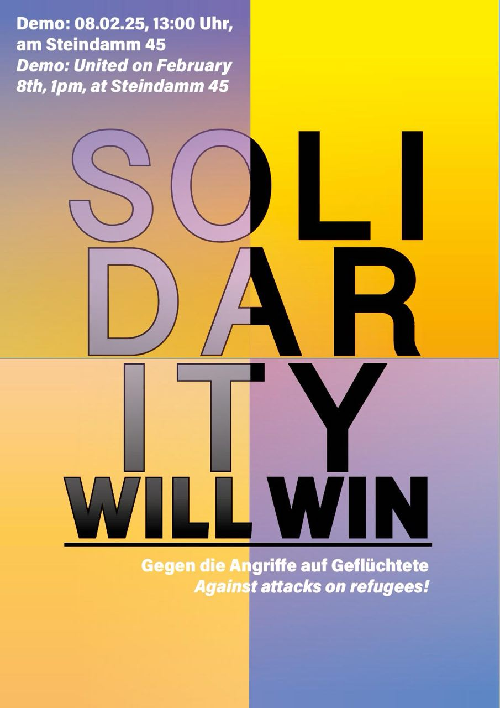

<header>
  <!-- TL;DR -->
</header>

# Solidarity will win

Other languages [DE](./README.md), [Farsi](./farsi.md)

## Demonstration - 08.02.2025 

### United against attacks on refugees!

The massive attacks on the human and fundamental rights of people seeking protection that we are currently experiencing 
are deeply shocking. The undermining of the right to asylum through ever new tightening measures, the deportation 
offensive, surveillance and harassment measures, as well as prison camps at Europe's external borders: \
For months, we have had to experience how parties, the federal government and the Hamburg Senate have been running 
after the AfD and implementing one right-wing demand after another. Refugees are deliberately put in mortal danger, 
people die every day at the external borders, in the Mediterranean, the Sahara or in Libyan torture camps. 
Those who have made it this far are increasingly deprived of rights, harassed on a daily basis by immigration 
authorities and payment cards and forced to live in overcrowded camps,humiliated by racist controls and often in 
constant fear of deportation. \
And as if all this wasn't bad enough, the CDU is calling for even tougher measures and declaring migrants 
to be the scapegoats for all social problems. It is the profit interests of the rich, exploitation, 
environmental destruction and war that cause social hardship and force people to leave their homes. 
Blaming and attacking refugees of all people for this is vile and racist. \
This policy strengthens the AfD and normalizes its inhumane agenda. \
It is about time we stopped all this!

Everyone has the right to a self-determined life in freedom, dignity and security, and to seek refuge from violence, 
persecution and war. We want to live in a society that recognizes these rights for everyone, that creates safe routes 
for refugees and in which no one has to be afraid of being deported. \
We oppose racism and demand social justice and 
equal rights for all people! That’s why we are taking to the streets together in Hamburg on February 8, 2025 - loud,
angry and in solidarity.

We call on all Hamburg residents to join us and stand together: \
Against the attacks on people seeking protection and migrants. \
For solidarity and a society of the many!
